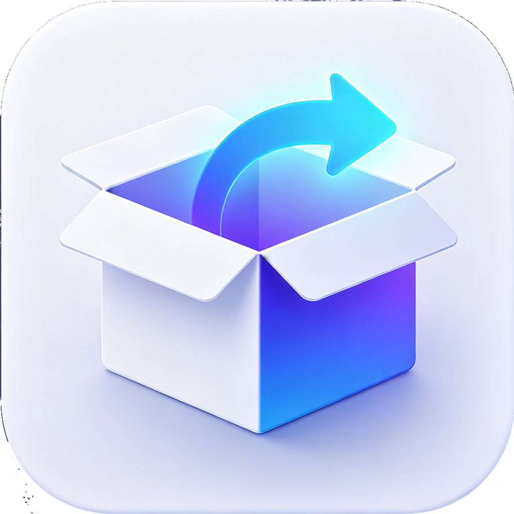

# sitebox



**Turn any website into a native macOS desktop app.**

A lightweight Swift + WKWebView wrapper — no Electron, no Chromium, no bloat. Wrap SaaS tools, chat apps, dashboards, or internal platforms into standalone desktop applications.

[]()
[]()
[](LICENSE)


## Why sitebox

Tired of losing important web apps among 50 browser tabs? sitebox turns them into proper macOS apps with their own Dock icon, window, and keyboard shortcuts.

- **Chat apps** (Feishu, Slack, Discord, Teams)
- **Dashboards** (Grafana, Datadog, internal analytics)
- **SaaS tools** (Notion, Linear, Figma, Jira)
- **AI assistants** (ChatGPT, Claude, Copilot)
- **Anything web-based** that deserves its own window

## Features

- **Native Image Viewer** — click any image opens a floating window, draggable anywhere on desktop
- **Dark Mode** — follow system appearance, force dark/light, or inject dark CSS into websites
- **Download Manager** — progress tracking, system notifications, save to Finder
- **Smart Domain Routing** — same-domain links stay in-app, external links open in default browser
- **Memory Efficiency** — ~50MB typical usage, auto-clean runtime cache, memory pressure handling
- **Customizable** — app name, window size, icon, toolbar visibility, status bar icon
- **Keyboard Shortcuts** — full navigation, zoom, dev tools, force reload
- **No Electron** — native SwiftUI + WKWebView, 10× lower memory, 5× faster startup

## Comparison

| | sitebox | Nativefier | Electron Wrapper |
|---|---|---|---|
| Engine | WKWebView | Electron/Chromium | Electron/Chromium |
| Memory | ~50 MB | ~200 MB | ~250 MB |
| App Size | ~5 MB | ~100 MB | ~150 MB |
| Startup | Instant | Slow | Slow |
| macOS Native | ✅ | ❌ | ❌ |
| Dark Mode Injection | ✅ | ❌ | ❌ |
| Image Viewer | ✅ | ❌ | ❌ |

## Install

### Download (Recommended)

Download `sitebox.dmg` from [Releases](https://github.com/ijson-projects/sitebox/releases).

### Build from Source

```bash
# Requirements: macOS 15+, Xcode 17+
git clone https://github.com/ijson-projects/sitebox.git
cd sitebox
./package.sh          # build .app
./create_dmg.sh       # create .dmg (optional)
```

## Usage

1. Launch sitebox
2. Click ⚙️ or `⌘,` to open Settings
3. Enter any URL (e.g., `https://www.ijson.com`)
4. Set a custom app name
5. Save — the website loads as a native app

### Keyboard Shortcuts

| Keys | Action |
|------|--------|
| `⌘[` `⌘]` | Back / Forward |
| `⌘R` | Reload |
| `⌘+` `⌘-` `⌘0` | Zoom in / out / reset |
| `⌘,` | Settings |
| `⌥⌘I` | Developer Tools |
| `⇧⌘D` | Download Manager |
| `⇧⌘R` | Force Reload (clear cache) |

### Custom Icon

Place your own icons in `custom_icons/`:

- `AppIcon.png` — 1024×1024 (app icon)
- `StatusBarIcon.png` — 1024×1024 (menu bar icon, template)

## License

Proprietary. See [LICENSE](LICENSE) for details.
